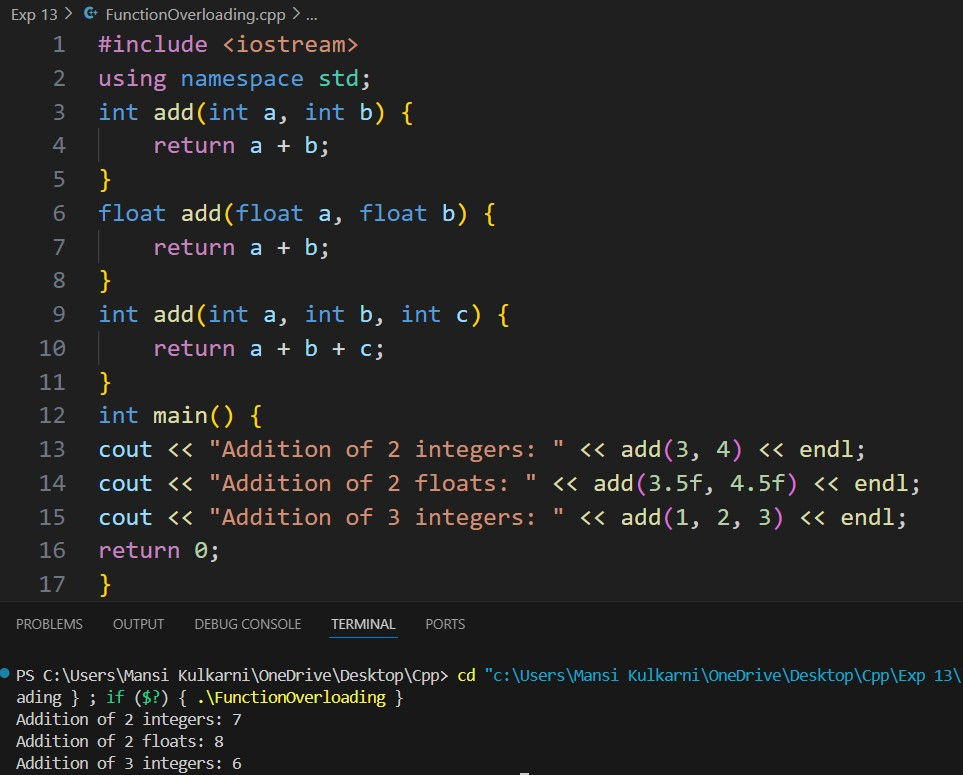
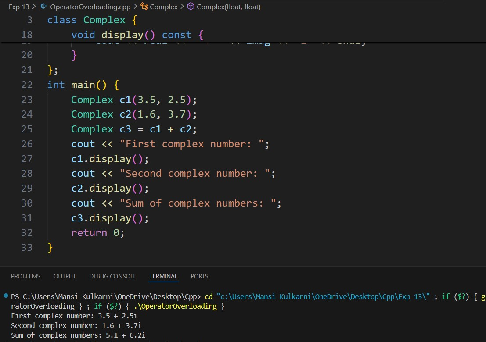

# Experiment 13
## Program 1
### Aim: 
To implement Function Overloading. 
### Software used: 
Visual Studio Code
### Theory:
Function overloading in C++ allows multiple functions with the same name to coexist in the same scope, as long as they have different parameter lists (either in number, type, or both). The compiler differentiates between the functions based on the argument types or number of arguments provided during the function call. Function overloading enhances readability and usability by allowing a single function name to perform similar tasks with different input types.
### 
Functions must differ in parameter type, number of parameters, or both.
The return type alone cannot be used to distinguish overloaded functions.
### Output:

### Conclusion:
We learned how to implement function overloading in C++. 

## Program 2
### Aim: 
To implement Operator overloading. 
### Software used: 
Visual Studio Code
### Theory:
Operator overloading in C++ allows the programmer to redefine the behavior of standard operators (like +, -, *, ==, etc.) for user-defined types (classes or structs). By overloading operators, you can enable class objects to use these operators meaningfully. For instance, you can define how the + operator works for a custom Complex number class to add two complex numbers.
###
Not all operators can be overloaded (e.g., ::, sizeof, ?:).
The overloaded operator behaves as a function and can have different implementations based on the class.
Operator overloading does not change the precedence or associativity of operators.
### Output:

### Conclusion:
We learned how to implement operator overloading in C++. 
